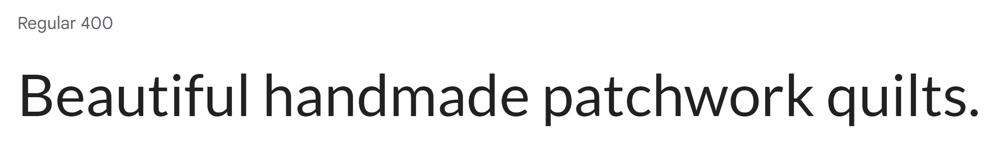
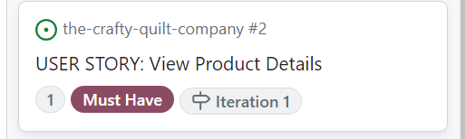

# The Crafty Quilt Company

Live Version: [The Crafty Quilt Company](https://the-crafty-quilt-company-c484a7353540.herokuapp.com/)

Repository: [GitHub Repo](https://github.com/Jem212Mac/the-crafty-quilt-company)

Developed by [Jemima MacKenzie](https://github.com/Jem212Mac).

Stripe Test Card: 4242 4242 4242 4242

Stripe Test Card for Authentication: 4000 0025 0000 3155

## About

This is a B2C ecommerce website targeted at people who love beautiful handmade patchwork quilts.  The website offers consumers the ability to buy already finished handmade quilts, or to buy everything they might need to make a colourful patchwork quilt for themselves (e.g fabric, thread, batting, tools and accesssories, and books to help learn different quilting and patchwork techniques).  The home page for the site provides a welcoming and colourful hero image demonstrating the type of quilts that can be bought or made, and the 'shop now' button allows the consumer to dive straight in and look at all the store has to offer.  The site includes a main navigation allowing the user to view products by category, price, and name, and includes a search bar that allows the customer to search for products by keywords in the product name, description, brand or author.  See selected screenshots (on different viewport sizes) below.

## UX Design

The target audience for the site is anyone that loves colourful, handmade, patchwork quilts and either wants to but them, or make them.  Since most of the products would be very colourful and bright, I wanted to make sure that the backdrop for the product images would be relatively plain and uncluttered in order to show the products in their full glory.  I did not want the backdrop to distract the customer's attention away from the stunningly colourful and bright products.  Therfore I chose a fairly simple colour scheme of mostly black and white with small flourishes of colour in 'english violet':

In terms of typography, I chose to use only one font style (Lato).  This is a relatively plain, but stylish, font that would be easy to read and not distract the consumer from the brightly coloured and fancy products.

At the outset of the project, I created the following wireframe designs using [Figma](https://www.figma.com/):

## Database Schema

The planning and design of the wireframes helped me to decide on the database schema I would need, and this was created using [LucidChart](https://www.lucidchart.com/):

## SEO, Content, and Marketing Strategies

### SEO Keywords

### Facebook Page

The target audience for the site is most likely to be middle-aged women.  As such, I decided that this demographic was most likely to use facebook for social media, rather than twitter or instagram which usually attracts a younger audience.  Therefore I created a facebook business page and included a link to the page in the site.  See screenshots below.

## Features & User Story Planning

In order to plan the project, I used agile methodologies.  I created a project kanban board and populated it with a number of user stories (see below), based on the following epics.

 - Epic 1: Create a website that allows users to search for and purchase beautiful handmade quilts and materials and accessories to help make patchwork quilts themselves.  Includes user stories [#1](https://github.com/Jem212Mac/the-crafty-quilt-company/issues/1), [#2](https://github.com/Jem212Mac/the-crafty-quilt-company/issues/2), [#11](https://github.com/Jem212Mac/the-crafty-quilt-company/issues/11), [#12](https://github.com/Jem212Mac/the-crafty-quilt-company/issues/12), [#13](https://github.com/Jem212Mac/the-crafty-quilt-company/issues/13), [#10](https://github.com/Jem212Mac/the-crafty-quilt-company/issues/10), [#3](https://github.com/Jem212Mac/the-crafty-quilt-company/issues/3), [#4](https://github.com/Jem212Mac/the-crafty-quilt-company/issues/4), [#14](https://github.com/Jem212Mac/the-crafty-quilt-company/issues/14), [#15](https://github.com/Jem212Mac/the-crafty-quilt-company/issues/15), [#16](https://github.com/Jem212Mac/the-crafty-quilt-company/issues/16), [#19](https://github.com/Jem212Mac/the-crafty-quilt-company/issues/19), [#17](https://github.com/Jem212Mac/the-crafty-quilt-company/issues/17), [#5](https://github.com/Jem212Mac/the-crafty-quilt-company/issues/5), [#6](https://github.com/Jem212Mac/the-crafty-quilt-company/issues/6), [#8](https://github.com/Jem212Mac/the-crafty-quilt-company/issues/8), [#7](https://github.com/Jem212Mac/the-crafty-quilt-company/issues/7), [#9](https://github.com/Jem212Mac/the-crafty-quilt-company/issues/9), [#18](https://github.com/Jem212Mac/the-crafty-quilt-company/issues/18).
 - Epic 2: Create a website that allows users to write reviews for products sold on the site in order to help customers decide on their next purchase.  Includes user stories [#30](https://github.com/Jem212Mac/the-crafty-quilt-company/issues/30) and [#31](https://github.com/Jem212Mac/the-crafty-quilt-company/issues/31).
 - Epic 3: Create a website that allows users to add products to their wishlist so they can purchase them at a later date.  Includes user stories [#28](https://github.com/Jem212Mac/the-crafty-quilt-company/issues/28) and [#29](https://github.com/Jem212Mac/the-crafty-quilt-company/issues/29).
 - Epic 4: Create a website that allows users to contact the site owners and interact with the site via their facebook business page and newsletter.  Includes user story [#34](https://github.com/Jem212Mac/the-crafty-quilt-company/issues/34).
 - Epic 5: Create a website that allows superusers (store owners) to add, edit, and delete products from the site.  Includes user stories [#25](https://github.com/Jem212Mac/the-crafty-quilt-company/issues/25), [#26](https://github.com/Jem212Mac/the-crafty-quilt-company/issues/26), and [#27](https://github.com/Jem212Mac/the-crafty-quilt-company/issues/27).

I decided on three iterations for the project.  My main aim for the first two iterations was to complete most of the user stories and deploy it, while the third iteration would focus more on testing the website and completing documentation.  I used MoSCow prioritisation to prioritise the user stories and tasks in each iteration.  I estimated user stories and tasks based on the following user story since I thought it was one of the smallest pieces of work to be undertaken.  Giving this an estimate of one story point, I estimated other user stories relative to this one using a Fibonnaci sequence.

Since I had no 'velocity' measures to use to give an indication of how many story points I could complete in an iteration, I estimated, based on my baseline user story, that I could complete 50 story points per iteration.  As such, I ensured that iteration one included no more than 30 story points (60%) that were MUST HAVE or SHOULD HAVE priorities.  The kanban board for iteration one at the outset looked like this:

Towards the end of Iteration 1, I found that I had completed all of the tasks and user stories for the iteration, but I had no time left spare.

Based on my velocity measure for Iteration 1, for Iteration 2, I included user stories totalling 44 story points (since I knew I would be taking at least one day off during this iteration), with MUST HAVE and SHOULD HAVE priorities totalling 26 story points (less than 60%):

At the end of Iteration 2, however, I found that I did not have time to complete the following user stories, and I moved them back to the backlog.  In Iteration 2, I completed 31 story points.

For Iteration 3 I included user stories totally 50 story points with MUST HAVE and SHOULD HAVE priorities totalling 29 story points (less than 60%):

At the end of Iteration 3, I completed all of the user stories except for two, which I marked as won't do and moved back to the backlog.  In iteration 3, I completed 46 story points.

## Technologies used

- ### Languages:
    
    + [Python 3.12.2](https://www.python.org/downloads/release/python-385/): the primary language used to develop the server-side of the website.
    + [JS](https://www.javascript.com/): the primary language used to develop interactive components of the website.
    + [HTML](https://developer.mozilla.org/en-US/docs/Web/HTML): the markup language used to create the website.
    + [CSS](https://developer.mozilla.org/en-US/docs/Web/css): the styling language used to style the website.

- ### Frameworks and libraries:

    + [Django](https://www.djangoproject.com/): python framework used to create all the logic.
    + [Bootstrap](https://getbootstrap.com/): used for styling the project.

- ### Databases:

    + Code Institute PostgreSQL Database: database used to store all the data.

- ### Other tools:

    + [Git](https://git-scm.com/): the version control system used to manage the code.
    + [Pip3](https://pypi.org/project/pip/): the package manager used to install the dependencies.
    + [Gunicorn](https://gunicorn.org/): the webserver used to run the website.
    + [Django-allauth](https://django-allauth.readthedocs.io/en/latest/): the authentication library used to create the user accounts.
    + [Django-crispy-forms](https://django-cryptography.readthedocs.io/en/latest/) was used to control the rendering behavior of Django forms.
    + [Heroku](https://id.heroku.com/login): the cloud platform used to host the website.
    + [GitHub](https://github.com/): used to host the website's source code.
    + [Chrome DevTools](https://developer.chrome.com/docs/devtools/open/) was used to debug the website.
    + [Font Awesome](https://fontawesome.com/) was used to create the icons used in the website.
    + [Google Fonts](https://fonts.google.com/) was used to select fonts for the website.
    + [Favicon.io](https://favicon.io/) was used to generate a favicon for the website.
    + [Coolers](https://coolors.co/) was used to generate the colour scheme for the website.
    + [LucidChart](https://www.lucidchart.com/) was used to create the ERD.
    + [Figma](https://www.figma.com/) was used to create wireframes for the site.
    + [Am I Responsive](https://ui.dev/amiresponsive?) was used to create the headline image for the README.md
    + [W3C Validator](https://validator.w3.org/) was used to validate HTML5 code for the website.
    + [W3C CSS validator](https://jigsaw.w3.org/css-validator/) was used to validate CSS code for the website.
    + [JShint](https://jshint.com/) was used to validate JS code for the website.
    + [PEP8](https://pep8ci.herokuapp.com/) was used to validate Python code for the website.
    + [Table to Markdown](https://tabletomarkdown.com/) was used to convert excel tables into markdown for the TESTING.md file.

## Local Development
Gitpod was used as the IDE for local development of the application and GitHub was used for version control.

## Testing
For details of all testing performed, including validator testing and manual testing, please see [TESTING.md](TESTING.md).  This also includes details of bugs found and resolved throughout the development process.

## Forking

If you would like to work on this code you can click on the repository here (https://github.com/Jem212Mac/the-crafty-quilt-company) and click on 'Fork' to create your own fork of the code to work on.

## Deployment

The application was deployed to Heroku.  In order to deploy to Heroku, the following steps were performed:

1. 'pip3 install gunicorn~=20.1' was used in the IDE terminal to install a production ready webserver for Heroku.
2. The command 'Pip3 freeze --local > requirements.txt' was used in the IDE terminal in order to create a requirements.txt file which included the dependencies for the project.  Heroku needs this file to install the required dependencies before the application is run.
3. A Procfile containing 'web: gunicorn gabbygourmand.wsgi' was created in the root of the project directory.
4. ,'.herokuapp.com' was added to the allowed hosts in the project settings.py file.
5. I created a new Heroku account here: (https://id.heroku.com/login).
6. From the Heroku dashboard I clicked 'Create new app' and input a unique name for the app, a region, and clicked 'create app'.
7. I clicked on the Settings tab and went to the Config Vars section.
8. I added the appropriate details to Config Vars.
9. I clicked on the 'Deploy' tab, chose Github as my deployment method, and searched for my github repository to connect.
10. For this project I chose to automatically deploy with every git push.

## Future Enhancements

Given more time there are a number of enhancements I would like to make to the website:
1. I would allow Sign Up or Sign In with social media accounts.

## Credits & Acknowledgements

 - On a number of occasions I contacted Tutor Support to help me better understand certain coding practices and techniques better and I would like to thank them for their help and support.
 - I would like to thank my mentor, Iuliia Konovalova, for her guidance during this project.